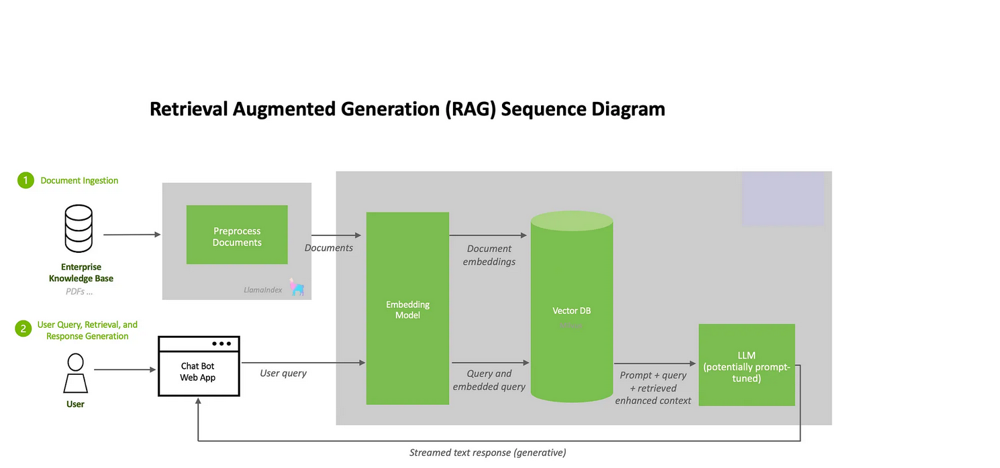
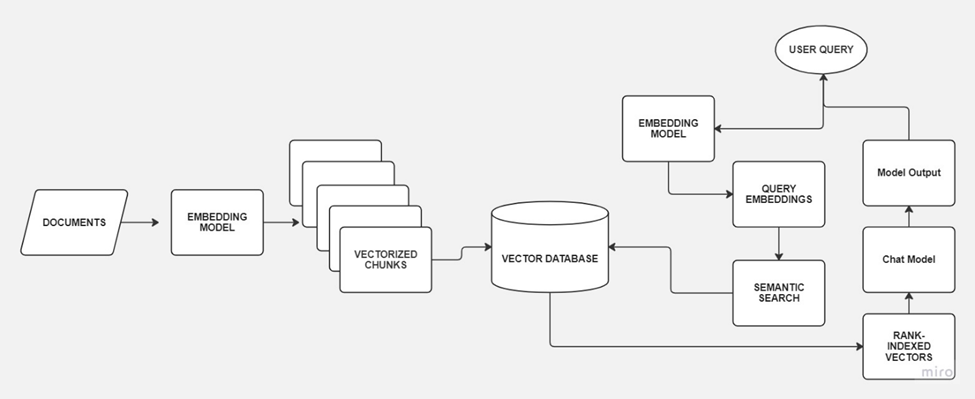

### LLM-RAG-Modeling-System

An AI Agent, powered by large language models (LLMs) **Personalized Agent**, processes user queries to determine actions following 

Components include the core **Personalized Agent** contain semantic search & retrieval, LangChain Tools for task integration, and a vector database for efficient retrieval. The LLM generates responses after analyzing user queries and retrieved information about **Documents analysis**, while additional context from external sources enriches responses. This system likely **accesses specific knowledge bases of Project intersting** . User interaction occurs through query and Personalized System interfaces, creating informative and interactive exchanges

### Run the Application with Shell Script 

1. Run the shell script to install the required packages and libraries:

```bash
sudo chmod +x run.sh && ./run.sh
```
2. run to server Ollama Open Source Model 

```bash 
sudo chmod +x Deploy.sh && ./Deploy.sh
```

3. Run the application Direclty with Shell Following 

```bash 
sudo chmod +x app.sh && ./app.sh
```

**System Architecture:**

* **LLM-RAG Modeling System:** This component utilizes Retrieval-Augmented Generation (RAG) to process user queries. It converts text data (queries) and financial documents into numerical representations for efficient retrieval using semantic search. This retrieval process is facilitated by a vector database storing document embeddings. 

<div align="center">
    </br>
    <figcaption>AI-powered Margin prediction analysis</figcaption>
</div>


### LLM Agent Planer Schema 
A LangChain Agent, powered by large language models (LLMs), processes user queries to determine actions. Components include the core module, semantic search & retrieval, LangChain Tools for task integration, and a vector database for efficient retrieval. The LLM generates responses after analyzing user queries and retrieved information about **Documents analysis**, while additional context from external sources enriches responses. This system likely **accesses specific knowledge bases of Project intersting** . User interaction occurs through query and Personalized System Finance interfaces, creating informative and interactive exchanges.

<div align="center">
    </br>
    <figcaption>Agent LLM   </figcaption>
</div>


### WorkFlow Pipeline project : 

The diagram below  depicts a Retrieval Augmented Generation (RAG) sequence diagram. It outlines a four-step process for building an AI system that They provide dynamic analysis integrated with tailored dashboards, transforming investment **decision-making of Cost margrin**. Let's break down the steps involved :


**Step 1: Define the Most Capable LLM and Locally Run Quantized Model LLM**

* **Goal:** Identify the most suitable large language model (LLM) for the project and configure it to run efficiently on the local hardware.
* **Explanation:** LLMs are AI models trained on massive amounts of text data. They can generate text, translate languages, write different kinds of creative content, and answer the questions in an informative way. However, they require significant computing power. In this step, we'll choose an LLM model that balances accuracy and efficiency for running locally on the hardware. Quantization is a technique to reduce the size and computational demands of an LLM model without significantly affecting its accuracy.

**Step 2: Fine-Tune the Model on Specific Data Domain of Chosen Projects Colab Platform**

* **Goal:**  Adapt the LLM to the specific terminology, language, and domain of the Projects Colab Platform's incident data.
* **Explanation:** LLMs are trained on general datasets, **which may not perfectly align with the Projects Colab Platform's specific needs. Fine-tuning involves training the LLM on a more focused dataset related to the Data Domaine .** This helps the LLM become familiar with the specific language used by improve its ability to identify relevant patterns and trends.

**Step 3: Define the Pipeline RAG System and Which Suite Vector Database to Use**

* **Goal:**  Design the Retrieval Augmented Generation (RAG) system pipeline and select a suitable vector database for storing and retrieving information.
* **Explanation:** RAG systems combine LLMs with information retrieval techniques. In this step, we'll design the pipeline for how the LLM will interact with the retrieval system. Here's a breakdown of the retrieval augmented generation process:
    1. User Query: A user submits a query about a potential incident.
    2. Retrieval: The RAG system retrieves relevant documents from the vector database based on the user query.
    3. Prompt + Retrieved Enhanced Context: The retrieved documents and the user query are then used to create a prompt for the LLM. This prompt provides context to the LLM and helps it generate a more accurate and informative response.
    4. LLM Response Generation: The LLM leverages the prompt to generate a response, such as predicting an incident or proposing solutions.
*  **Vector Database Selection:** we'll also need to choose a vector database to store and efficiently retrieve information for the RAG system. Vector databases use a mathematical approach to represent and search information. They are particularly useful for applications like document retrieval where we need to find similar documents based on their content.

**Step 4: Building UI Interface Interaction Between User and LLM Model Such Streamlite**

* **Goal:** Develop a user interface (UI) that allows users to interact with the LLM model. 
* **Explanation:**  In this step, we'll design a user interface where users can submit queries and receive responses from the LLM. This could be a Personalized System Finance interface similar to OpenChat or Chauit, or another type of interface that is best suited for the Projects Colab Platform's needs.

##  LLM Building Flow 

This section details the chosen technology stack for each development step of the AI system, with explanations for each component:

**Step 1: LLM Selection and Optimization**

* **Technology:** Hugging Face Ecosystem with PyTorch for model manipulation
* **Explanation:** We will leverage the Hugging Face ecosystem, a popular open-source community for natural language processing (NLP). This ecosystem provides access to various pre-trained LLMs and tools for working with them. PyTorch, a deep learning framework, will be used for model manipulation and fine-tuning.
* **Options:**
    * **Ollma:** Ollma ([https://github.com/ollama/ollama](https://github.com/ollama/ollama)) is a library built on top of Hugging Face Transformers that offers functionalities for efficient inference and deployment of large language models. It can be used for model optimization and potentially improve local inference speed.
    * **LlamaCPP (Optional):** LlamaCPP ([https://github.com/ggerganov/llama.cpp](https://github.com/ggerganov/llama.cpp)) offers C++ implementations of various pre-trained LLMs. While this might require more development effort for integration, it could lead to significant performance improvements on compatible hardware.


**Step 3: RAG System Pipeline and Vector Database Selection**

* **Technology:** Retrieval System (LlamaIndex, LangChain, or Vector Database) with Python Programming Language
* **Explanation:** We will design a pipeline using Python for the Retrieval Augmented Generation (RAG) system. This pipeline will involve retrieving relevant documents from a chosen vector database based on the user query and then using those documents to inform the LLM's response generation. Here are some vector database options:
    * **LlamaIndex:** ([https://github.com/run-llama/llama_index](https://github.com/run-llama/llama_index)) This option leverages the Llama library for efficient document retrieval and integrates well with the Hugging Face ecosystem.
    * **LangChain:** ([https://github.com/langchain-ai/langchain](https://github.com/langchain-ai/langchain)) This platform offers a suite of tools for building NLP applications, including document retrieval functionalities.
    * **Vector Database (Chroma or Alternatives):** Standalone vector databases like Chroma ([https://github.com/demvsystems/ai-chroma](https://github.com/demvsystems/ai-chroma)) can also be used for efficient document retrieval. Other popular options include FAISS, Pinecone, and Milvus.
* **Additional Note:** Here, the Hugging Face Transformers library ([https://huggingface.co/docs/transformers/en/index](https://huggingface.co/docs/transformers/en/index)) offers a built-in `EmbeddingModel` for RAG systems that might be worth exploring as well.

**Step 4: Building UI Personalized System Finance **

* **Technology:** Streamlit
* **Explanation:** Streamlit ([https://blog.streamlit.io/build-a-chatbot-with-custom-data-sources-powered-by-llamaindex/](https://blog.streamlit.io/build-a-chatbot-with-custom-data-sources-powered-by-llamaindex/)) is a Python library specifically designed for creating data apps and user interfaces. It allows rapid development of interactive interfaces without extensive web development experience. We will utilize Streamlit to build a Personalized System Finance interface for users to interact with the LLM model.


        
